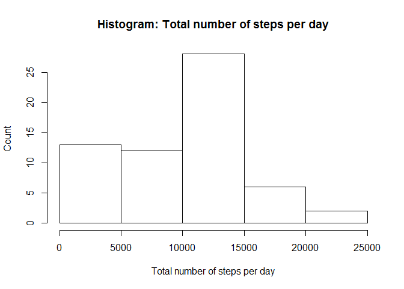
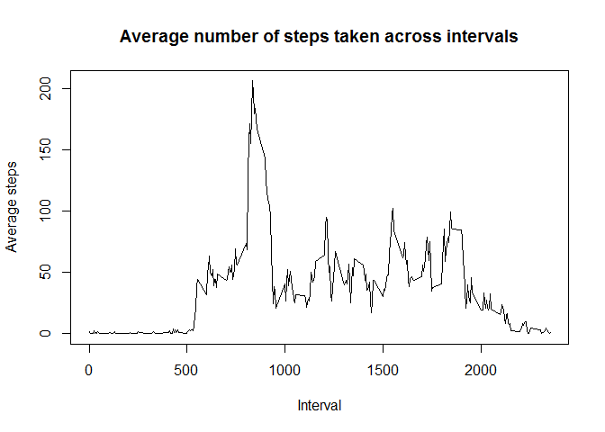
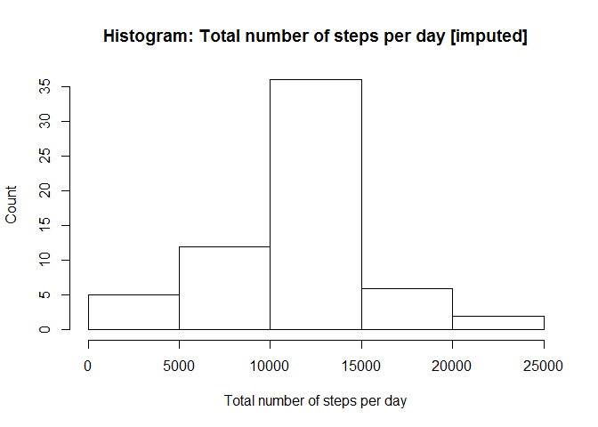
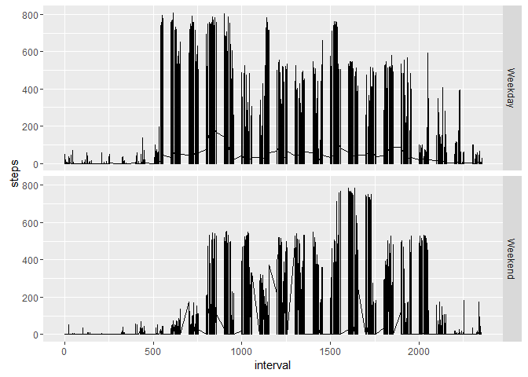

# Jonathan Sinclair - Peer Graded Assignment: Course Project 1
Peer Graded Assignment: Course Project 1
========================

#####Author: Jonathan Sinclair

*follow me on Twitter* : @_J_sinclair


```r
##load relevant packages & data
library(plyr)
library(dplyr)
library(chron)
library(ggplot2)
##Assumes Zip folder is in working directory (still zipped)
act <- read.csv(unz("repdata_data_activity.zip", "activity.csv"))
## Convert act$date to as.Date()
act$date <- as.Date(x = act$date, "%Y-%m-%d")
```

## What is the mean total number of steps taken per day

**1) Calculate the total number of steps taken per day**


```r
steps_per_day <- act %>% 
  group_by(date) %>% 
  summarize(steps=sum(steps, na.rm=TRUE))

total_steps_per_day <- sum(steps_per_day$steps)
print(paste("Total number of steps taken per day =", total_steps_per_day))
```

```
## [1] "Total number of steps taken per day = 570608"
```

**2) Make a Histogram of the total number of steps taken each day**


```r
hist(steps_per_day$steps, main="Histogram: Total number of steps per day", ylab="Count", xlab="Total number of steps per day")
```



**3) Average and Median steps per day**


```r
      ## Mean
mean_steps_per_day <- mean(steps_per_day$steps)
print(paste("Average steps taken per day =", mean_steps_per_day))
```

```
## [1] "Average steps taken per day = 9354.22950819672"
```

```r
      ## Median
median_steps_per_day <- median(steps_per_day$steps)
print(paste("Median steps taken per day =", median_steps_per_day))
```

```
## [1] "Median steps taken per day = 10395"
```

...................................

## What is the average daily activity pattern?

**1) Make a time series plot of the 5-minute interval and the average number of steps taken, averaged across all days**


```r
# Proccess / Transform data
average_steps_per_day <- act %>%
  group_by(interval) %>%
  summarize(av_steps=mean(steps, na.rm=TRUE))

# Make Plot
plot(average_steps_per_day, type="l", main="Average number of steps taken across intervals", xlab="Interval", ylab="Average steps")
```




**2) Which 5 minute interval on average, contains the maximum number of steps?**


```r
which.max(average_steps_per_day$av_steps)
```

```
## [1] 104
```
Interval 104

...................................

## Imputing Missing Values

**1) Calculate and report the total number of missing values in the dataset**


```r
## reporting number of missing values in the data set
sum(is.na(act))
```

```
## [1] 2304
```

**2) Devise a strategy for filling in missing values in the dataset**

Here we will use the **mean** of each **5 minute interval** to impute the values

```r
average_steps_per_interval<- act %>% 
  group_by(interval) %>% 
  summarize(av_steps=mean(steps, na.rm=TRUE))
```

**3) Create a new dataset that is equal to the original, but with the missing values filled in**

```r
act$steps[is.na(act$steps)] <- average_steps_per_interval$av_steps
##now all values are filled in
head(act,2)
```

```
##       steps       date interval
## 1 1.7169811 2012-10-01        0
## 2 0.3396226 2012-10-01        5
```


**4) make a histogram of total number of steps per day. Report mean and median, do values differ from the estimates from the first part of the assignment? What is the impact of imputing missing values on the total?**


```r
## calculate total number of steps per day
steps_per_day<- act %>% 
  group_by(date) %>% 
  summarize(num_steps=sum(steps))

total_steps_per_day <- sum(steps_per_day$num_steps)

## make histogram
hist(steps_per_day$num_steps, main="Histogram: Total number of steps per day [imputed]",
     ylab="Count", 
     xlab="Total number of steps per day")
```



```r
## calculate mean and median
mean_steps_per_day <- mean(steps_per_day$num_steps)
median_steps_per_day <- median(steps_per_day$num_steps)

## Print values
paste(c("Total steps per day = ", total_steps_per_day))
```

```
## [1] "Total steps per day = " "656737.509433962"
```

```r
paste(c("Mean steps per day = ", mean_steps_per_day))
```

```
## [1] "Mean steps per day = " "10766.1886792453"
```

```r
paste(c("Median steps per day = ", median_steps_per_day))
```

```
## [1] "Median steps per day = " "10766.1886792453"
```

**analysis**

Due to imputing missing values, as you can see:

* Total number of steps per day have increased
* Mean number of steps have increased 
* Median number of steps have increased

These values clearly differ from those obtained at the first part of the assignment, before values were imputed. 
So we can thus conclude that imputing the data has an impact (of increasing) the total, mean, and median number of steps recorded each day.

......................

## Are there differnces in activity patterns between weekdays and weekends?

**1) Create a new factor variable inside the dataset with two levels "weekday" and "weekend".**

```r
act$weekend <- as.factor(is.weekend(act$date))
act$weekend <- revalue(act$weekend, c("TRUE" = "Weekend", "FALSE" = "Weekday"))
```


**2) Make a pannel plot containing a time series plot of the 5 minute interval and the average number of steps taken, averaged across all weekdays or weekend days.**

```r
g <- ggplot(data=act, aes(x=interval, y=steps))
g + facet_grid(weekend ~ .) + geom_line()
```




